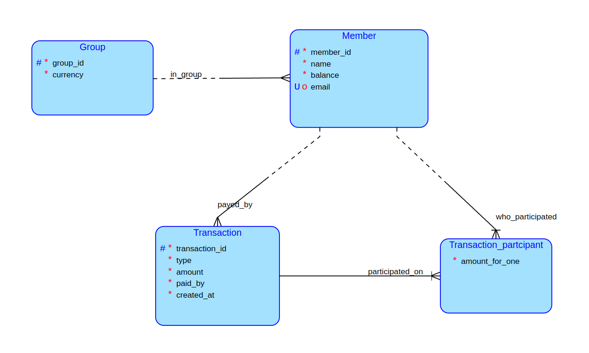

# Navall
Navall is a ledger for your group expenses. Simply add your expenses to the group, track your balance. And when you want to settle up the debts, Navall will suggest you the payments.

## Business operations
### Create
- **Group and Members**: Create a new group and it's members
- **Transactions**: Record transactions and add participants
### Get
- **Member's balance**
- **Group transactions**: Retrieve table of transactions within a specified period of time
- **Settlement suggestions**: View suggested transactions from Members with negative balance to those with positive balance, resolving the debts
### Update
- **Members**: Rename Member, update email
- **Transactions**: Edit participants, transaction amounts, and add or remove participants

## Database Diagram

## Complex query
**Calculate settlement suggestions**: Generate suggested transactions from Members with negative balance to Members with positive balance.
